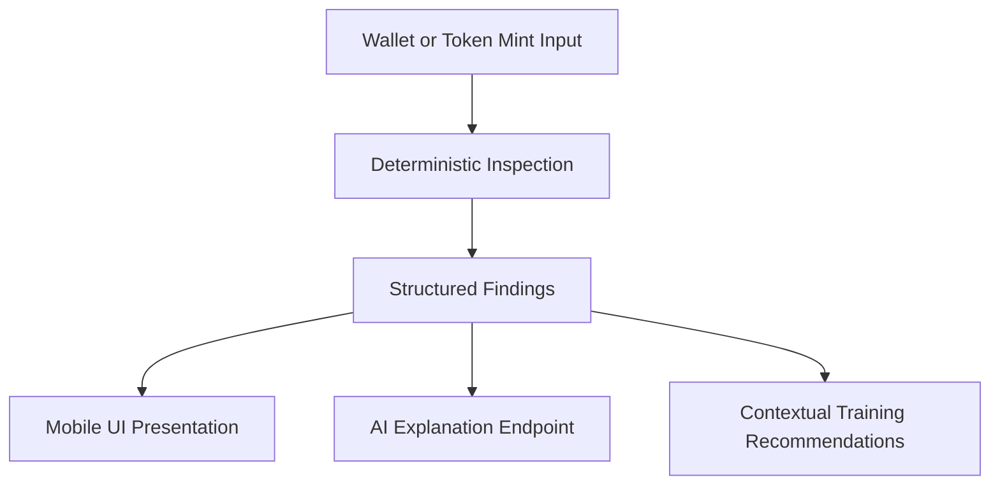

# TrainRekt

TrainRekt 2.0.0 is a Solana security awareness and training application that combines real on-chain inspection with practical simulated security training.

Core positioning:

Wallet security tools protect the wallet. TrainRekt trains the human behind it.

TrainRekt presents technical signals and educational context. It does not provide blanket "safe token" or "safe wallet" verdicts.

## Hackathon Release

- Release version: 2.0.0
- Planned tag (not created in this step): v2.0.0
- Planned APK filename: TrainRekt-v2.0.0.apk

TrainRekt 2.0.0 is the hackathon release built by Pascal as a solo developer/founder.

## What TrainRekt Does

### Token Safety

TrainRekt accepts a Solana token mint (including Android share-intent text extraction for a single mint) and runs deterministic inspection through the TrainRekt API.

Current token analysis includes:

- Token identity and metadata context where available
- Mint authority state
- Freeze authority state
- Token program context (SPL Token / Token-2022)
- Largest-token-account concentration and context
- Identity provenance and trusted-source mint-link analysis
- Deterministic on-chain summary findings

The current Token Analysis UI intentionally avoids a global token verdict label. It presents technical findings and context instead.

TrainRekt can request an AI explanation for inspection results, but AI is an explanation layer over deterministic findings.

AI does not independently prove whether a token is safe.

### Wallet Safety

TrainRekt connects to a real wallet on Android via Solana Mobile Wallet Adapter and performs public read-only inspection.

Current wallet safety behavior includes:

- Wallet authorize/connect flow
- Public wallet identity display (address/label)
- Read-only Solana RPC wallet snapshot
- Token-account and mint-level technical observations
- Token-2022 extension observations for supported extension kinds
- Wallet-derived training recommendations

TrainRekt does not move assets or execute destructive wallet actions as part of inspection.

### Security Training

TrainRekt provides realistic simulated scenarios with immediate feedback and explanation.

Implemented exercise families:

- Decision training
- Signature simulation
- Transaction inspection
- Permission challenges
- Scam detection
- Red flag identification
- Surprise security challenges

Current runtime catalog size is 41 exercises.

### Progress

TrainRekt tracks learning progress locally, including:

- Sessions and decisions
- Correct vs incorrect outcomes
- XP and level progression
- Win rate
- Streaks
- Skill scores
- Recent training history
- Earned challenge badges

Daily training behavior is implemented with a goal of 3 completed daily decisions and a one-time daily completion bonus.

## Security and Trust Boundary

- Deterministic code establishes inspection facts.
- AI explains deterministic findings when available.
- Training scenarios are simulated.
- Real wallet or on-chain context can drive recommendations, but training interactions do not submit real asset transactions.
- Real wallet message signing remains runtime-disabled in the current implementation.

## Install the Android APK

Judges should receive/download the artifact named:

- TrainRekt-v2.0.0.apk

### Option A: Install directly on Android / Solana Seeker

1. Download or copy TrainRekt-v2.0.0.apk to the device.
2. Open the APK file from the browser or file manager.
3. If Android asks for "install unknown apps" permission for that source, allow it for that specific app.
4. Continue the install flow.
5. Launch TrainRekt.

Android may show normal warnings for APKs installed outside an app store.

### Option B: Install with ADB

Prerequisites:

- Android Platform Tools (adb)
- USB debugging enabled on the device
- Device connected and authorized

Commands:

```bash
adb devices
adb install -r TrainRekt-v2.0.0.apk
```

If `adb devices` does not show the device as authorized, accept the device authorization prompt and run again.

If an incompatible prior build blocks installation, use the confirmed package ID from app configuration and reinstall:

```bash
adb uninstall com.anonymous.trainrekt
adb install -r TrainRekt-v2.0.0.apk
```

## Runtime Requirements

### Using the prebuilt APK

- Internet access is required for on-chain inspection features.
- Wallet Safety uses public Solana RPC reads from the mobile app.
- Token Analysis requires a reachable TrainRekt API base URL embedded at build time via `EXPO_PUBLIC_TRAINREKT_API_BASE_URL`.
- A compatible Solana wallet app on Android is required for wallet-connected flows.

Important:

- This repository confirms how configuration is consumed, but cannot by itself prove which backend URL a separately distributed APK was built with.
- If the release APK points to a public hosted backend, judges do not need local backend setup.
- If it points to a private/local backend, token analysis endpoints will be unavailable until that backend is reachable.
- For a judge using only the prebuilt APK, no local API keys should be required in-app. Backend keys remain server-side.

### Running from source

Mobile prerequisites observed in this repo:

- Node.js + npm (Node version is not pinned in package.json)
- Expo SDK 57.x stack
- Android SDK + adb
- JDK 17+
- Physical Android device for MWA flows

Backend prerequisites observed in this repo:

- .NET SDK 8.x (`net8.0` target)
- Helius API key for Helius-dependent inspection behavior
- Optional services: Gemini and MongoDB (feature-flag/config dependent)

Mobile setup and run:

```bash
cd mobile
npm install
npx expo run:android --device
npx expo start --dev-client --clear
```

Fresh-clone native generation note:

- This repository ignores `mobile/android` and `mobile/ios` as generated native output.
- If those folders are absent in a fresh clone, generate Android from tracked Expo config first:

```bash
cd mobile
npx expo prebuild --platform android --no-install
```

- Then continue with `npx expo run:android --device` or `cd android && ./gradlew assembleRelease`.

Backend setup and run (local dev):

```bash
cd backend/TrainRekt.Api
dotnet user-secrets set "Helius:ApiKey" "<your-helius-api-key>"
cd ../..
dotnet run --project backend/TrainRekt.Api --launch-profile http
```

Health check:

```bash
curl http://localhost:5256/health
```

Backend build/tests:

```bash
dotnet build backend/TrainRekt.Api/TrainRekt.Api.csproj
dotnet test backend/TrainRekt.Api.Tests/TrainRekt.Api.Tests.csproj
```

Backend Docker + Render (Web Service):

- Render Root Directory: `backend/TrainRekt.Api`
- Dockerfile Path: `backend/TrainRekt.Api/Dockerfile`
- Health Check Path: `/health`
- Container port handling: container startup maps `PORT` to Kestrel via `ASPNETCORE_URLS=http://0.0.0.0:$PORT` (with fallback to `8080` when `PORT` is not set).

Render environment variables (no values in source control):

- Required: `HELIUS_API_KEY`
- Optional: `ASPNETCORE_ENVIRONMENT` (defaults to `Production` in Dockerfile)
- Optional: `Gemini__Enabled`, `GEMINI_API_KEY`, `AiSafetyCoach__Enabled`, `TokenExternalContext__Enabled`
- Optional: `MongoDb__Enabled`, `MONGODB_CONNECTION_STRING`, `MongoDb__DatabaseName`

Mobile checks:

```bash
cd mobile
npm run typecheck
npm run lint
npm run test
```

Android release build from generated native project:

```bash
cd mobile/android
./gradlew assembleRelease
```

## Architecture Overview



Trust boundary summary:

- Deterministic inspection establishes technical facts.
- AI endpoints generate educational explanation and prioritization.
- AI is not a source of on-chain truth.

## Testing and Quality

Validated on this release-prep pass:

- Mobile typecheck: passed
- Mobile lint: passed
- Mobile tests: passed (113 files, 590 tests)

Backend tests can be run with the command documented above when backend release verification is required.

## Project Links

- Mobile app workspace: [mobile](mobile)
- Mobile implementation guide: [mobile/README.md](mobile/README.md)
- Demo and reproducibility checklist: [docs/DEMO_PREFLIGHT.md](docs/DEMO_PREFLIGHT.md)
- Backend details: [backend/README.md](backend/README.md)
- Demo video: [demo/trainrekt-hackathon-demo.mp4](demo/trainrekt-hackathon-demo.mp4)
